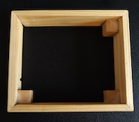
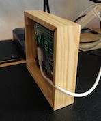

# GB Renewable Forecast Display
   

This Raspberry Pi powered eInk display aims to give you a quick way to time your home energy usage to help balance the grid, reduce carbon emissions, and if you're an [agile tariff user](https://octopus.energy/agile/), save money.

The project takes the same approach as [shouldibake.com](http://shouldibake.com/) and the [Baking Forecast GB](https://twitter.com/baking4cast) to give you quick visual aid when making that decision, showing you when renewable generation is above or below 33%.

Data is provided by the [National Grid's carbon intensity api](https://carbonintensity.org.uk/) and [Octopus Energy's Agile tariff pricing API](https://developer.octopus.energy/docs/api/#list-tariff-charges)

## Components
1. Raspberry Pi Zero soldered (~£14) ([piehut](https://thepihut.com/products/raspberry-pi-zero-wh-with-pre-soldered-header) | [pimoroni](https://shop.pimoroni.com/products/raspberry-pi-zero-wh-with-pre-soldered-header))
2. Micro SD card (~£7) ([piehut](https://thepihut.com/collections/raspberry-pi-sd-cards-and-adapters/products/noobs-preinstalled-sd-card) | [pimoroni](https://shop.pimoroni.com/products/noobs-32gb-microsd-card-3-1?variant=31703694245971))
3. Inky wHAT (ePaper/eInk/EPD) - Black/White (£45) ([piehut](https://thepihut.com/products/inky-what-epaper-eink-epd-black-white) | [pimoroni](https://shop.pimoroni.com/products/inky-what?variant=21214020436051))
4. Power supply - micro USB connection ([piehut](https://thepihut.com/products/official-raspberry-pi-universal-power-supply) | [pimoroni](https://shop.pimoroni.com/products/raspberry-pi-universal-power-supply) - or use an existing cable) 
5. [Case](#case) (see notes below)

## Install and setup

### Raspberry Pi Setup

I use a "headless" Raspberry Pi setup to install all the dependencies; we configure the wifi settings prior to powering on the 
Pi & enable SSH by default, this mean we avoid having to connect a display or a keyboard.

### 1. Flash pi with Raspberry Pi OS lite (no desktop)
* Use [Raspberry Pi Imager](https://www.raspberrypi.org/software/) 
* Select SD card
* Choose "Raspberry Pi OS (other)" > "Raspberry Pi OS Lite (32-bit)" (we dont require a GUI desktop)
* Select write & wait for the OS to be written to the SD card.

### 2. Configure Wifi & Enable SSH (create file /Volumes/boot/ssh)
* Once the Rapsberry Pi OS image has been saved to the SD card, open a file window so that you can view the contents of the SD card's 'boot' folder
* Create a new file `wpa_supplicant.conf` in the root of the boot folder & add the following, replacing the relevant sections with your SSID and password for your wifi network
```
  ctrl_interface=DIR=/var/run/wpa_supplicant GROUP=netdev
  network={
    ssid="YOUR_SSID"
    psk="YOUR_WIFI_PASSWORD"
    key_mgmt=WPA-PSK
  }
```
Example file: [conf/wpa_supplicant.conf](https://github.com/openbook/shouldi-eink-display/blob/main/conf/wpa_supplicant.conf)
* Finally create an empty file called 'ssh' (without a file extension) in the boot directory, this will enable SSH by default when you first power on the pi
  
### 3. Power on the pi and SSH onto the device
* Insert the SD card into the Raspberry Pi
* Install the Raspberry Pi into the back of the Inky display - align the Pi, with the 40 GPIO pins pointing down, to the top right hand corner of the back of the Inky display and gently push the the GPIO pins into the black connector.  [See an image of the reverse of display](./assets/thumbs/reverse.jpg).
* Power on the Pi & wait for ~2 minutes whilst the operating system boots up.  
* At this point you'll need to create a SSH connection to the Pi from your current laptop/desktop.  You can read more about [SSH (Secure Shell) & find a client for you machine here](https://www.raspberrypi.org/documentation/remote-access/ssh/)
* If this is the only Raspberry Pi on your network you'll be able to access the Pi using the device's hostname with following SSH command which should be run on
```bash
ssh pi@raspberrypi.local
# password is 'raspberry'
```
otherwise, you will need to find the IP of your Pi via your local network router then start a SSH session using
```bash
ssh pi@[IP ADDRESS]
# password is 'raspberry'
```

### 4. Run the install script
* In your SSH terminal, ensure you're first in the pi user's home directory by running `cd ~/`
* Install the dependencies for both the Inky display & the api/drawing libraries by running the following command 
  
```curl https://raw.githubusercontent.com/openbook/shouldi-eink-display/main/install.sh | bash```
* When prompted enter Y to install the required inky libraries
* When prompted 'Do you wish to perform a full install?' enter N 
* Once the install script has finished, the Pi will be rebooted to ensure all the libraries are correctly loaded now that the inky display is connected.

### 5. SSH back in to the Pi & set the display configuration
* First SSH back into the pi
* By default the 'combined' forecast and current generation mix is displayed.  Full info on each of the screens is [available here](#displays).
You can update the display by changing the values found within the 'config.ini' that was downloaded as part of the setup:
* Using a text update the contents of the file found at `/home/pi/shouldi-eink-display/config.ini`
* Update the `display = combined` line choosing one of the following options:
    * combined - renewable forecast plus current generation mix
    * forecast - the full "should i bake" forecast
    * agile - agile tariff hourly prices for the current day
    * generation - current renable generation mix for a local area
* If selecting "agile" then the postcode and placename should be changed from the current values in the same file.  **Note** postcodes should be added using the first half only (e.g. for SW1A 0AA use SW1A)
* see '#displays' for notes on each display screen
* If everything has installed properly you should now be able to update the display by running the following command 
```bash
cd /home/pi/shouldi-eink-display && python3 display.py
```


### 6. (Optionally) control the display config using a webform hosted on the Pi 


You can also setup and run a simple web form which will allow you to switch the current screen display using a browser. 

* still using the SSH session, make sure you are in the project root folder `cd ~/shouldi-eink-display`
* run `./install-web.sh` this will setup an nginx webserver and serve a simple flask based webapp that will allow you to update the config.ini file.
* Once the install script has finished, it should confirm the IP address of your Pi - you can then open that IP address in a browser to access the web interface shown above 

### 7. :tada: Done
Hopefully everything should be setup and working ok.  

Your display is set to update automatically at 5 & 35 minutes past each hour.  

## [Screens](#displays)

| Screen  | Config.ini name | Description |
| ------------- | ------------- | ------------- |
|    | combined | **Combined current generation mix + renewable forecast**<br /><br />**Now** <br />how much of the current electricity supply, coming from the National Grid, is being generated from renewable sources (wind, hydro & solar) <br /><br />  **Forecast** <br />for the next (up to) 4 days, which slots (morning, afternoon, evening or night) are forecasted to have renewable generation higher than 33% <br />  - where there's a tick, generation is forecasted to be greater than 33% <br />  - where there's a cross, generation is forecasted to be lower than 33%, avoid doing any activities at home which consume a lot of electricity during these times if you can <br /> - where the tick or cross is underlined - this shows the period during the day which is forecasted to have the highest renewable generation.  Try to plan your high demand activities for these time.  |
|    | agile | **(Octopus) Agile Tariff pricing**<br /><br />Displays the cost p/kWh (pence per kilowatt hour) for each hour over the current day.<br />See the full [documentation here](https://developer.octopus.energy/docs/api/#list-tariff-charges) for more information |
|  | forecast | **Baking forecast** [shouldibake.com](https://www.shouldibake.com) [@baking4cast](https://twitter.com/baking4cast) <br /><br />**Right now, Bake!/Can baking wait?**<br />tells you whether the current renewable generation level is higher than 33%<br /><br /> **Forecast** <br />for the next (up to) 4 days, which slots (morning, afternoon, evening or night) are forecasted to have renewable generation higher than 33%<br /> - where there's a tick, generation is forecasted to be greater than 33%<br /> - where there's a cross, generation is forecasted to be lower than 33%, avoid doing any activities at home which consume a lot of electricity during these times if you can<br /> - where the tick or cross is underlined - this shows the period during the day which is forecasted to have the highest renewable generation.  Try to plan your high demand activities for these time. |
|  | generation | **Local generation for your region**<br /><br />Using a postcode supplied in the config.ini file, this display shows the current generation mix specific to your region. |
 
## [Case](#case)

### Make your own
 

I created a simple frame using some pine stripwood (6x25mm), which was then treated with danish oil.  This works well and with a 
small cut out for the USB power cable sits flush against a wall when fixed with a nail.

### Modeled and 3d printed LargeCover enclosure by [Printminion](https://twitter.com/printminion)

This is a great professional looking case that's ready to buy and simple to install.  

**Note**, unless you are going to [solder the pi to the inky manually](https://youtu.be/q5ER7cTRDVo) then you'll need the 'enclosure' + 'large cover'.  

* [Details on twitter](https://twitter.com/printminion/status/1170751384800714753)
* [3d print files on thingverse.com](https://www.thingiverse.com/thing:3325556)
* [Buy enclosure](https://www.shapeways.com/product/FB38M3F8G/enclosure-for-pimoroni-inky-what-and-raspberry-pi?optionId=83324972) & [large cover](https://www.shapeways.com/product/GGAD2ERJP/largecover-for-pimoroni-inky-what-and-raspberry-pi?optionId=121238893) on Shapeways 


## To do
- [ ] Add a physical button to switch between displays
- [ ] Add error handling for all outgoing requests
- [ ] Image uploader for custom screen of when generation is high and low
- [ ] Move carbonintensitylib to pandas for consistency and to improve code qualityΠ 
- [ ] Add more in depth view for agile pricing - show current, min and max prices 
- [ ] Add a battery pack & [power management](https://thepihut.com/products/wittypi-mini-rtc-power-management-for-raspberry-pi#:~:text=WittyPi%20Mini%20is%20the%20new,OFF%20sequence%20with%20simple%20script.)

